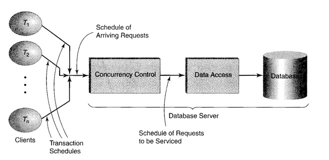

#Concurrency Control

Suppose our university has over 10 thousand undergraduate students, and when the deadline for registration approaches, we might expect hundreds of students to be using the Student Registration System at the same time. The system must ensure that such a large number of concurrent users does not destroy the integrity of the database. Suppose, for example, that because of room size limitations, only 50 students are allowed to register for a particular course (that is one of the integrity constraints of the database), and suppose that 49 have already registered. If two additional students attempt to register concurrently, the system must ensure that no more than one of them succeeds. 
One way to ensure the correctness of concurrent schedules is to run transactions serially, one at a time. Thus, when two students try to register for the last opening in a course, the transaction initiated by one of them will execute first, and that student will be registered. Once it has completed, the transaction initiated by the second will execute and that student will be told that the course is full. This type of execution is called serial, and the execution of each transaction is said to be isolated-the I in ACID. 

The serial execution of a set of transactions has an important property. Recall that our assumption that transactions are consistent-the C in ACID-implies that if the database is in a consistent state and a transaction executes in isolation, it will execute correctly. Since the database has been returned to a consistent state, we can initiate the execution of a second transaction and, because it too is consistent, it will also execute correctly. Hence, if the initial database state is consistent, serial execution of a set of transactions-one transaction at a time-will be correct. 

Unfortunately, serial execution is impractical. Databases are central to the operation of many applications and so must be accessed frequently. A system that requires that transactions be executed serially simply cannot keep up with the load. Furthermore, it is easy to see that, in many cases, serial execution is unnecessary. 

For example, if transaction T1 accesses tables X and Y and if transaction T2 accesses tables U and V, the operations of T1 and T2 can be arbitrarily interleaved and the end result-including the information returned by the DBMS to the transactions and the final database state-will be identical to the serial execution of T1 followed by T2 and also identical to the serial execution of T2 followed by T1. Since serial execution is known to be correct, this interleaved schedule must be correct as well. 

The interleaved execution of a set of transactions is potentially far more efficient than serial execution of that set. Transaction execution requires the services of multiple system resources-primarily CPU and I/O devices-but a transaction frequently utilizes only one of these resources at a time. With concurrent execution of several transactions, we can potentially utilize a number of these resources simultaneously and hence improve system throughput. For example, while a CPU is doing some computation for one transaction, an I/O device might be providing I/O service for another. 

Unfortunately, certain interleaved schedules can cause consistent transactions to behave incorrectly, returning the wrong result to the application and producing inconsistent database states. For that reason, we cannot allow arbitrary interleav­ings. The first question is how to decide which interleavings are good and which are bad. The next question is how to implement an algorithm that permits the good in­terleavings and prohibits the bad. We call such an algorithm a concurrency control. It schedules database operations requested by concurrently executing transactions in a way that ensures that each transaction is isolated from every other transaction. 

In most commercial transaction processing systems, concurrency control is done automatically and is invisible to the application programmer who designs each transaction as if it will execute in a non concurrent environment. Nevertheless, it is important to understand the concepts underlying the operation of concurrency controls because 

1. Using a concurrency control to achieve isolation, in contrast to simply allowing arbitrary interleavings, can result in a significant increase in response time and a significant decrease in transaction throughput (measured in transactions per second). Hence, many commercial systems allow the option (sometimes as the default) of running transactions so that they are not completely isolated: various levels of reduced isolation are implemented. Since the designer might be tempted to use one of these options to increase system efficiency, it is important to understand how these reduced levels of isolation can lead to inconsistent databases and incorrect results.

2. Whether the designer chooses to achieve complete isolation or some reduced level of isolation, the overall efficiency of an application can be strongly influenced by the interaction between the concurrency control and the design of both the tables and the transactions within that application.

Isolation is a complex issue, so we break our discussion into two parts. Here, we are primarily interested in isolation in an "abstract" database system. By "abstract" we mean a database in which each data item has a name, and read and write operations name the item that they access. A separate topic will be devoted to isolation in a relational database system, in which data is accessed using SQL statements that use conditions to identify rows to be addressed. Studying isolation in abstract databases helps us focus on key issues in concurrency control. The specifics of relational databases will lead to a refinement of the techniques developed for the abstract case. 

## Schedules and Schedule Equivalence 
The concurrency controls we are interested in will work in any application. We do not discuss concurrency controls that are designed with a specific application in mind. In particular, we are not interested in controls that utilize information about the computation a particular transaction is carrying out. We are interested in controls that must separate good interleavings from bad ones without knowing what the transaction is doing. 

For example, a transaction might read the value of a variable in the database. If the concurrency control knows that the variable represents a bank account balance and that the transaction will request the read as a first step of a deposit operation, it might be able to use that information in choosing an acceptable interleaving. However, we assume that this information is not available to the concurrency control. 

If we cannot use application-specific information, how do we decide which in­terleavings are correct? The answer lies in our basic assumption that each transaction is consistent and that therefore serial schedules must be correct. From this it follows that any interleaved schedule that has the same effect as that of a serial schedule must also be correct, and this is the correctness criterion we use. We will refine the notion of "has the same effect as that of a serial schedule" later, but you should understand that this is a conservative notion of correctness. As we shall see, for many applications, there will be executions that are correct even though they do not "have the same effect as that of a serial execution." 

We assume that a transaction is a program whose data space includes the database and its local variables. While the local variables are accessible only by that transaction, the database is global and accessible by all transactions. The transaction uses different mechanisms to access the two parts of its data space. The local variables are directly accessible by the transaction (i.e., in its virtual memory), but the database is accessible only through calls to procedures provided by the database manager. 

For example, at a very low level of implementation detail, the transaction asks the database manager to copy a block of data from the database into its local variables this is a read request; or it asks to overwrite a portion of the database with data stored in local variables-this is a write request. At this level, we view the database as a collection of data items and do not presume to know anything about the type of information stored in a data item. Also, we make no assumptions as to where the database is stored. Most likely, it is stored on a mass storage device, but in situations in which rapid response is required it can be stored in main memory. 

A transaction, then, is a program in which computations made with the local variables are interspersed with requests for access to the database made to the database manager. Since the computation (on local variables) is invisible to the database manager, the manager's view of the execution of a transaction is a sequence of read and write requests, which we call a transaction schedule.

 If pi,j is the jth request made by transaction Ti, then pi,1,pi,2, · · · ,pi,n  is the transaction schedule of Ti, which consists of n requests to the database manager. 

Since transactions execute concurrently, the database manager must deal with a merge of transaction schedules, which we refer to simply as a schedule. The database manager has the responsibility of servicing each arriving request. However, doing so in the order of arrival might lead to incorrect behavior. Hence, when a request arrives, a decision must be made as to whether to service it immediately. This decision is made by the manager's concurrency control. If the concurrency control decides that immediately servicing a request might lead to an incorrect schedule, it can delay servicing to a later time or it can abort the requesting transaction altogether. 

Hence, the schedule serviced by the database manager might not be the same as the sequence of requests that arrives at the concurrency control. The concurrency control will, in general, reorder the requests. It cannot, of course, reorder the requests of a single transaction. Since we assume that a transaction is a sequential program, it will not submit a request until the previously submitted request has been serviced. The goal of the concurrency control is to reorder requests of different transactions in the arriving schedule so as to produce a correct schedule for servicing by the database manager. The system organization is shown in figure below. 

Note that transforming the arriving schedule is not without its costs. A transaction might be either delayed or aborted. Delaying transactions reduces the overall concurrency level within the system and therefore can increase average response time and decrease throughput. Aborting a transaction is worse since it requires that the computation be repeated. Thus, it is important that the concurrency control does no unnecessary transformations, but should recognize as many correct arriving schedules as possible. Concurrency controls are generally incapable of recognizing all correct schedules and therefore sometimes perform unnecessary schedule transformations. The goal in designing a concurrency control is to minimize this waste. 

We assume that the execution of each database operation is atomic and isolated with respect to other database operations. (This assumption might seem trivial for a simple read or write operation in an abstract database but is not so trivial for a complex SELECT operation in a relational database.) Although we have assumed that the concurrency control does not know the semantics of transactions (i.e., the nature of the computations), we assume that it does know the effect of each database operation, which we refer to as operation semantics. In this chapter, we are mainly concerned with read and write operations. In another topic, we will consider the operations performed on a relational database, such as SELECT and UPDATE. 

## Equivalence of schedules 
Operation semantics is used to determine allowable schedules. To explain how, we must first explain what it means for two schedules to be equivalent. Recall that a schedule is correct if it is equivalent to a serial schedule. So what does it mean for two schedules to be equivalent? 

We say that two database operations, p1 and p2, commute if, for all possible initial database states, 

p1 returns the same value when executed in either the sequence p1, p2 or p2, p1
p2 returns the same value when executed in either the sequence p1, p2 or p2, p1
The database state produced by both sequences is the same
Note that commutativity is symmetric: if p1 commutes with p2, then p2 commutes with p1. 

Suppose that p1 and p2 are requests made by different transactions and are successive operations in a schedule, S1. Then S1 has the form S1, 1, p1, p2, S1,2 

where S1, 1 is a prefix of S1, and S1,2 is a suffix of S1. Suppose the two operations p1 and p2 commute. Then in schedule S2, S1, 1, p2, p1, S1,2 

all transactions perform the same computations as in schedule S1 since the values returned to each transaction by read requests are the same in both schedules. Furthermore, both schedules leave the database in the same final state. Hence, we say that schedules S1 and S2 are equivalent. 

Operations that do not commute are said to conflict. Most important, two operations on different data items always commute. Commutativity is also possible between operations on the same item. For example, two read operations on the same item commute. However, a read and a write on the same item conflict because, although the final state of the item is the same independent of the order of execution, the value returned to the reader depends on the order of the operations. Similarly, two write operations on the same item conflict since the final state of the item depends on the order in which the writes occur. 

In any schedule, successive operations that commute with each other and belong to different transactions can always be interchanged to form a new schedule that is equivalent to the original. Since equivalence is transitive we can demonstrate the equivalence of two schedules-both of which are merges of the same set of transaction schedules but which differ substantially in the way the merges are done-using a sequence of such simple interchanges. Unfortunately, demonstrating the equivalence of two schedules by performing such interchanges would be awkward for a concurrency control to do. 

The design of most concurrency controls is based on the following theorem, which is an alternate way to demonstrate the equivalence of two schedules: 

Theorem (schedule equivalence).
Two schedules of the same set of operations are equivalent if and only if conflicting operations are ordered in the same way in both schedules. 

Note that we can prove this theorem if we can demonstrate that 

A schedule, S2, can be derived from a schedule, S1, by interchanging commuting operations if and only if conflicting operations are ordered in the same way in both schedules. 

since we know that two schedules are equivalent if and only if one can be derived from the other by interchanging commuting operations. 

The "only if" part of the theorem follows from the observation that the order of conflicting operations is preserved by the interchange procedure. Thus if conflicting operations were ordered differently in both schedules, S2 could not have been obtained from S1 using the interchange procedure. 

The "if" part is a little more difficult. It can be demonstrated by showing that any schedule, S2 (of the same set of operations as in S1), in which conflicting operations are ordered the same way as in S1, can be generated from S1 using the interchange procedure. To show this, consider the schedule S1 : ...., pi,pi+1, pi+2, ...., pi+r, ...

Suppose that S2 is a schedule of the same set of operations, and in S2 conflicting operations are ordered the same way as in S1. Furthermore, suppose that there exists an i such that for all j satisfying 1≤j≤r−1, pi and pi+j are ordered in the same way in both S1 and S2, but that pi and pi+j are ordered differently. Thus, pi+r is the first operation following pi in S1 that is ordered differently in S2, and so pi+r precedes pi in S2. Operations pi and pi+r must commute since conflicting operations are ordered in the same way in S1 and S2. 

Assume now that there is some k satisfying 1≤k≤r−1 such that pi+r does not commute with pi+k· Then, in S2, the operations must be ordered ..., pi+k, ..., pi+r, ...., pi, ... since conflicting operations are ordered in the same way in both schedules. But this contradicts the assumption that Pi+r is the first operation following Pi in S1 that is ordered differently in S2. 

For this reason, the assumption that there exists a k satisfying 1≤k≤r−1 such that pi+r does not commute with pi+k, is false. Therefore,  pi+r commutes with all of the operations in pi, ..., pi+r-1,  and a series of interchanges of adjacent operations can be used to create a schedule equivalent to S1 that differs from S1 only in that pi+r precedes, rather than follows, pi (as it does in S2). The interchange procedure can be used repeatedly to reorder the operations that are ordered differently in S1 and S2 and thus to transform S1 into S2. 

## Serializability 
We have shown that, if conflicting operations are ordered in the same way in two schedules, they are equivalent. Using this rule, we can specify interleaved schedules that are equivalent to serial schedules, and it is these schedules that the concurrency control is designed to permit. We refer to such schedules as serializable. 

A schedule is serializable if it is equivalent to a serial schedule in the sense that conflicting operations are ordered in the same way in both. 

The notion of a serializable schedule provides the answer to our first question: How are we to decide which interleavings are correct? 

Since a serializable schedule is equivalent to a serial schedule and since we assume that all transactions are consistent, a serializable schedule of any application's transactions is correct. 

Serializable schedules are correct for any application. However, for a particular application, serializability might be too strong a condition (some non serializable schedules of that application's transactions might be correct) and can lead to an unnecessary performance penalty. Hence, concurrency controls generally implement a variety of isolation levels, the strongest of which produces serializable schedules. The application designer can choose a level appropriate for the particular application. 

[link to related video lecture](https://www.youtube.com/watch?time_continue=7&v=SwToXbclDdI)
