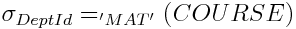

**Credits: contents presented here are taken from the book Database Systems An application oriented approach 2nd Edition by Michael Kifer, Arthur Bernstein, Philip M. Lewis**

# Database Tuning

**Tuning is the process of modifying an application and adjusting the parameters of the underlying DBMS to improve performance**. Performance is measured in terms of the response time seen by a user (the time it takes to perform a task—for example, to execute an SQL statement) and throughput (the amount of work completed in a unit of time). It is important to realize that tuning does not affect the semantics of the system: the tuned and the original systems return the same information to the user and are left in the same final state when subjected to the same sequence of requests.

The first step in tuning a system is to determine where the bottlenecks are. If the system spends only 2% of its time executing a particular (hardware or software) module, then no matter how inefficient it is, revising or replacing it can improve performance by at most 2%.

**An application and DBMS, taken together, form an exceedingly complicated system, and many different aspects of it are subject to tuning**.

The SQL code and schema are at the highest level. Tuning at this level is concerned with such issues as how queries should be expressed and what indices should be created. 

This section discusses methods that you can use to encourage the DBMS to use the technique that performs the best for the particular application you are implementing.

The DBMS occupies the next level. Examples of performance issues at this level are the physical placement of data on secondary storage and how the DBMS manages its buffers. Decisions in this area are largely under the control of the database administrator, and hence the application programmer can influence them indirectly. 

The lowest tuning level is the hardware level. In order to perform well the system must be supported by CPUs and secondary storage devices, and adequate communication facilities. The specification of these resources is generally beyond the control of the application programmer, and we do not discuss these issues.

## Disk Caches

There is huge difference between the speed of the CPU and the time to transfer a page between the CPU and mass store. In recognition of this, the cost of a query plan is measured as the estimated number of page transfers it incurs, and the job of the query optimizer is to find the plan that minimizes this number. While that plan is generally a good one, its cost is often still significant, and other measures are necessary to make query processing efficient. One of the most significant of these is the cache. 

**A cache is a main memory buffer in the DBMS in which recently accessed database pages are stored**. When a transaction accesses a database item, the DBMS brings the database page(s) on disk that contain that item into the cache and then copies the value of the item from the cache into the application’s buffer. The page is generally retained in the cache under the assumption that there is a high probability that the application will either update the item or read another item in the same page at a later time. Or another application might concurrently reference an item in the page. In either case, a disk access will have been avoided since the page will be directly accessible in the cache. For example, an index page has a high probability of being accessed frequently.

Although it is natural to think of the database item as a page of a table or an index, it can also be the execution plan for an SQL statement or a stored procedure. In fact, some DBMSs maintain a separate procedure cache for this purpose. Although I/O cost is the major limitation on the performance of an application, the CPU cost of building an appropriate execution plan is also substantial. Hence, once an execution plan has been determined, it is saved since it might be possible to reuse it. Prior to preparing a new execution plan, existing plans are scanned to see if any are usable.

If a database item is to be updated, the database page containing the item must first be brought into the cache (if it is not already there), and it is the cache copy of the page that is modified (not the original copy in the database).

Eventually the cache becomes full, and any new page fetched from the database must overwrite a page, p, in the cache. If p has not been updated since arriving in the cache, its contents are identical to the corresponding page in the database, and hence it can simply be overwritten by the new page. However, if p has been updated since arriving in the cache, it must be written back to the database before the space it occupies in the cache can be freed. In order to distinguish between these two cases, the DBMS marks pages that have been updated as dirty and those that have not as clean. 

Decisions concerning which pages should be kept in the cache and which can be overwritten when a new page is to be fetched are made by a **page replacement algorithm** whose goal is to maximize the number of database accesses that can be satisfied by pages in the cache. A **least recently used (LRU) algorithm**, for example, selects the least recently used page in the cache as the one to be replaced. It concludes that since no application has accessed the page recently it is no longer useful. Hence it tends to keep actively used pages in the cache.

A more sophisticated algorithm takes into account the circumstances under which a page was brought into the cache. For example, if the page was brought in as part of a table scan (which is typical, for example, when sorts are performed), once the rows in the page have been accessed it is not likely that the application will reference the page again. In this case a **most recently used algorithm (MRU)** is preferable. Hence a page replacement policy might use a combination of an LRU and an MRU algorithm depending on what information is contained in the page (index or data) and in what context the page is referenced.

If a transaction’s access request can be satisfied from the cache, a **hit** is said to have taken place; if it cannot be satisfied, then a **miss** has occurred. To obtain a high throughput, many designers consider it mandatory to obtain a hit rate of over 90% (90% of the accesses can be satisfied from the cache). To achieve such a hit rate, the cache size must often be a significant percentage of the size of the database. Cache sizes in the megabyte range are normal. In some large applications, the cache size is measured in tens of gigabytes.

## Tuning the Cache

Now that you have an understanding of how the cache works, the question is, “What can the application programmer or the database administrator do to optimize the way the DBMS uses the cache to improve the performance of her application?”

+ DBMSs generally offer several mechanisms that can be invoked for this purpose. Some DBMSs allow pieces to be carved out of the (default) cache to be managed as separate caches. The programmer can then bind a particular item (e.g., a table or an index) to a specific cache and in so doing cause all pages of that item to be buffered in that cache. For example, if tables T1, and T2 are bound to different caches, a page of T; can never overwrite a page of T2. This approach might be useful if T2 was not used very often but fast response time was required of the application that referenced it.

+ Some DBMSs allow a particular cache to be subdivided into several distinct pools of buffers of different sizes. For example, while by default all buffers in a cache might have 2K bytes, it might be possible to reallocate the cache storage area so that several buffer pools are created with sizes 2K, 4K, 8K, etc. If a table is bound to such a cache, the query optimizer then has the option of choosing the I/O size that best suits a query plan that accesses that table. For example, the page size on secondary storage might be 2K bytes, and the DBMS might allocate disk space to a table in contiguous blocks of eight pages. It then follows that the time to retrieve an eight-page block is not much larger than the time to retrieve a single page since the seek time is the same in both cases. If the query plan call for a table scan, and the table is bound to a cache that has a 16K pool of buffers, the query optimizer can save time by retrieving eight pages with a single I/O operation.

Some query optimizers take this idea one step further by prefetching pages. Ordinarily, during the scan of a table or index, the next page is requested when the page fetched by the previous I/O operation has been scanned. The scan must then wait until the I/O operation for the next page completes. It is possible to improve on this in situations, such as scans, in which the optimizer can anticipate future requests. In such cases the optimizer can initiate the I/O operation for a page that has not yet been requested. Then, if the time to process a page is long enough, the next page will already be in the cache when it is requested.

By using both prefetching and a large I/O size, the time to do a table scan can be greatly reduced. This possible reduction has an impact on the query optimizer’s choice between an access path that involves an index and an access path that uses a table scan for a particular query. It also raises the question of whether the application programmer should create an index for that query.

+ Some DBMSs provide commands that allow the page replacement policy for a cache to be specified. This is particularly useful when multiple caches are used.  A policy appropriate to the items bound to the cache can then be chosen.

In addition to configuring a data cache to best suit the application, the programmer can design the application to make the best use possible of a procedure cache. For example, performance can be improved by not using explicit constants in SQL statements. The execution plan for the statement

```sql
SELECT P.Name
FROM PROFESSOR P
WHERE P.DeptId = 'EE' 
```
is essentially the same as the execution plan for the statement with the constant EE replaced by CS. But since the two statements are different, the DBMS might miss this fact when it scans the procedure cache looking for an execution plan, and as a result the DBMS might create a separate execution plan for each statement. It is possible to eliminate this overhead by instead using the statement

```sql
SELECT P.Name
FROM PROFESSOR P
WHERE P.DeptId = :deptid
```

where deptid is a host variable, and successively assigning EE and CS to that variable. Since the same statement is now executed twice, the execution plan created when the statement is first executed will be reused when it is executed for the second time.

## Tuning the Schema

The schema you design for your database is at the heart of the application. If the schema is well designed, it is possible to write SQL statements that perform efficiently. Your strategy in tuning at the application level is to first design a normalized database and then estimate the sizes of the tables, the distribution of column values, and the nature and frequency of the queries and updates that will be addressed to the database. Adjustments to the normalized schema to facilitate the most frequent operations follow from these estimates. Adding indices is the most important of these adjustments, and we discuss it first. Another technique is denormalization, which involves adding redundancy so that items of information that are generally associated with one another through frequently executed queries can be found in one place. Finally, we discuss partitioning, which is a rather specialized technique for dealing with very large tables.

1. Indices
Different query plans for a particular query might have wildly different costs and in many cases the differences are a function of the indices used in the plan. For better or worse, the choice of plan is made by the optimizer based on the indices available to it at the time the query is prepared. It is the role of the application programmer to "encourage" a good choice by making sure that appropriate indices have been created. In this section our goal is to expose the reasoning a programmer might use in deciding what indices to create.

Indices might seem like the ultimate database tuning device. However, free computational lunches are rare. Each index carries an associated storage overhead. More importantly, extra indices might significantly increase the processing time of statements that modify the database since every index must be updated whenever the table it references is changed. Thus, you should think twice before creating an index on a table where rows are frequently inserted or deleted. Similarly, you should think twice before creating an index with a search key involving a frequently updated column. Will the performance gain realized in processing queries be sufficient to compensate for the added cost of processing statements that modify the table? To illustrate some of the considerations involved in the tuning process, consider the following examples 

1. Consider the query

```sql
SELECT P.DeptId  
FROM PROFESSOR P   
WHERE P.Name = :name  
```  

Since the primary key of PROFESSOR is Id, we can expect that the DBMS has created a clustered index on that attribute. That index is no help for this query because we need a quick way to find all professors with a particular name. One possibility is to explicitly create an unclustered index on Name. Assuming that only a few professors have the same name, this index should speed things up. 

But suppose this is not the case; many professors have the same name, Then  a better solution is to make the index on Name clustered and the index on Id unclustered. As a result, rows with the same name will be grouped together and can be retrieved in a single (or a few) 1/O operations. The index could be a B+ tree or a hash (since the condition on Name involves equality).

The lesson here is that since a table can have only one clustered index, it is pointless to waste it on an attribute that cannot take advantage of clustering. DBMSs generally create a clustered index on the primary key, but you should not be intimidated by this. An unclustered index on the primary-key attribute is sufficient to guarantee the key’s uniqueness, and since at most one row can have a particular key value, clustering cannot be justified as a means of grouping rows with the same value of the attribute. So, if we are unlikely to want to order rows based on the primary key (as is the case with PROFESSOR), there is no reason to use a clustered index for this purpose.

Keep in mind that replacing one clustered index with another is a time consuming operation since it implies a complete reorganization of the storage structure. You certainly do not want to create a new clustered index each time you execute a query. You should analyze your application in advance, considering the kinds of queries you expect and their frequency, create the clustered index that will do the most good, and stick with it until performance considerations indicate that the system needs a tune-up.

2. Consider the query

```sql
SELECT T.Name, T.CrsCode
FROM TRANSCRIPT T 
WHERE T.Grade = :grade 
```

One is tempted to cluster the rows around Grade since we want to retrieve all rows with the same grade, but suppose that our first priority is to speed the response to a different query, a request for a class roster, and for that purpose we use a Clustered index on the primary key (CrsCode, Semester, StudlId). We could create an unclustered index on Grade, but using such an index might not be a good idea. In most cases the number of rows with a particular grade is a large fraction of the total number of rows (since the domain of Grade is small). In those cases we can expect that a large fraction of the table’s pages will be fetched, one by one, in random order, through the unclustered index. Unfortunately, the optimizer does not know what grade will be supplied at run time, and even if it did, it would not know which ones produced small result sets (we will correct this inadequacy shortly). Hence a table scan might be a better solution. 

A number of lessons can be drawn from this example. First, an unclustered index is appropriate if only a few rows of a table are to be retrieved, and a full table scan is appropriate if a large fraction of the rows are to be retrieved. Determining a reasonable break-even point is not easy. One vendor states that a table scan is appropriate if more than 20% of the rows of the table are to be accessed. A more cautious approach would be to simulate the workload if more than a few rows are to be accessed to determine if building an index is a good idea. Second, do not create an index on a column with a small domain if attribute values tend to be evenly distributed over the domain. The query optimizer is unlikely to choose such an index since it will recognize that the selectivity of the access path through this index is large for any value of search key. Finally, do not create indices indiscriminately: they are costly to maintain, and, with the techniques described in Section Disk Cache, table scans can be quite fast.

3. Suppose that the most frequent access path to TRANSCRIPT selects rows based on a condition involving both StudId and CrsCode. A less frequently used path selects rows based on a condition on Semester. If we build one index on (StudId,CrsCode) (actually an index on the primary key (StudId,CrsCode, Semester) would work fine) and another on Semester, which should be clustered? At first glance, it might seem that the index on (StudId,CrsCode) should be clustered because it is the main access path. However, even though (StudId, CrsCode) is not a candidate key, the number of TRANSCRIPT rows that agree on both of these attributes will be one in almost all cases—only when a student retakes a course can this number be larger than one. Therefore, clustering around (StudId, CrsCode) will not yield significant benefits. Also, it is not likely that range queries will be asked against this pair of attributes, so the overhead of a B+ tree index does not seem justified—a hash index is probably the best solution here. On the other hand, a clustered B+ tree index on Semester can greatly improve the efficiency of selections and joins on that attribute and makes an excellent choice for a secondary access path.

The lesson here is that clustering is useful to group together rows that might be output in a result set. These rows might be grouped because they all agree on the value of an attribute(s) or because they fall within a range of values of that attribute(s). In either case, when a choice has to be made as to what attribute to cluster on, you should make the choice based on the size of the result sets you expect in your application.

4. Assume the PROFESSOR table has the additional attribute Salary, and suppose we want to optimize the performance of the range query:

```sql
SELECT P.Name
FROM PROFESSOR P
WHERE P.Salary BETWEEN :lower AND :upper
```

The analysis here is similar to that of example 1 with the exception that we now want a clustered index on Salary and it must be a B\+ tree.

5. If two different queries would benefit from two different clustered indices on the same table, we have a problem since only one clustered index is possible. One solution is to make it possible for the optimizer to use an index-only strategy. 
For example, suppose that TEACHING already has a clustered B\+ tree index on Semester, but another important query would benefit from a clustered index on ProfId in order to quickly access the course codes associated with a given professor. We can sidestep the problem by creating an unclustered B+ tree index with search key (ProfId, CrsCode). Then all the information required by the query is contained in the index (and the index is often referred to as a covering index), and TEACHING does not have to be accessed at all! We simply search down the index using ProfId to the leaf level. Since the values of CrsCode at that level are clustered around ProfId, we can scan forward from that point at the leaf level of the index to get the required result set using only the index entries. This approach produces the same effect as that of a clustered index with search key (ProfId, CrsCode) on TEACHING (in fact, it is more efficient because the index is smaller and hence scanning a section of the leaf level requires fewer I/O operations than scanning a section of TEACHING).

Index-only query processing comes in two varieties. In this example we searched the index using ProfId to quickly locate the associated course codes. Suppose, however, another query required that we find the ProfIds of all professors who had taught a particular course. Unfortunately, although all the information we need is in the index, it cannot be searched because CrsCode is not the first attribute of the search key. But all is not lost. Another way to produce the desired result set is to scan the entire leaf level of the index. This is not as efficient as a search, but it might be better than having to scan the entire data file (the index is smaller!) or create and use an unclustered index on CrsCode.

6. The ability to nest queries is one of the most powerful features of SQL. Unfortunately, however, nested queries are very difficult to optimize. Consider the query

```sql
SELECT P.Name, C.CrsName
FROM PROFESSOR P, COURSE C
WHERE P.Department = 'CS' AND C.DeptId = 'MAT' AND
C.CrsCode IN 
       (SELECT T.CrsCode 
			  FROM TEACHING T 
				WHERE T.Semester = 'S2003' AND T.ProfId = P.Id)
```

that returns a set of rows in which the value of the first attribute is the name of a CS professor who has taught a course in the Math Department in the spring of 2003 and the value of the second is the name of one such course.

Typically, a query optimizer splits this query into two separate parts. The inner query is considered as an independently optimized unit. The outer query is also optimized independently (with the result set of the inner SELECT statement viewed as a database relation). In this case, the subquery is correlated, so it is crucial that it be executed efficiently since it will be executed many times. 

For example, a clustered index on TEACHING with search key (ProfId, Semester) would permit quick retrieval of all courses taught by a particular professor in a semester (and hopefully this is a small set). If possible (as in this example), the search key should involve all the attributes of the WHERE clause to avoid retrieving rows unnecessarily.

However, there is another point to note here. Because the two queries are optimized separately, certain alternatives might not be considered by the optimizer. For instance, the use of a clustered index on TEACHING with search key CrsCode would not be considered since the correlated nested subquery produces a set of course codes for each value of P.Id that is supplied and CrsCode is not even mentioned in the WHERE clause of that subquery. On the other hand, it is easy to see that the above query is equivalent to

```sql
SELECT C.CrsName, P.Name
FROM PROFESSOR P, TEACHING T, COURSE C
WHERE _T.Semester='S2003' AND P. Department='CS'
AND C.DeptId = 'MAT' AND P.Id = T.ProfId AND T.CrsCode=C.CrsCode 
```
and the use of that index would be considered in optimizing this query. One strategy that can take advantage of this index corresponds to the following expression:


After computing 

, 

the index for CrsCode in TEACHING can be used to compute the join 

 in the index-nested loops algorithm.

It should be remarked that some query optimizers do, in fact, try to eliminate nested subqueries and take other steps to reduce the cost of processing them. However, it is still a good idea to avoid query nesting whenever possible. This strategy may or may not be the best for this query depending on the sizes of the relations, selectivity of the attributes, and other parameters.

7. Consider the query

```sql
SELECT T.Semester, COUNT(*)
FROM TRANSCRIPT T
WHERE T.Grade <= :grade
GROUP BY T.Semester
```
Our first inclination is to create a clustered B+ tree on Grade since a range is indicated. Our intention is to influence the optimizer to first retrieve all rows satisfying the condition, sort them on Semester (which brings all the members of a group together), and then count the size of each group. But this is not necessarily a good idea. The condition is not selective, so we will have to sort a large intermediate table.

Suppose instead we reverse the order of operations: we do the sort before the selection. In fact, if we choose a clustered index on Semester, the table is sorted before the query is executed. Since the grouping is already done, all we have to do is scan the table and count all the qualifying rows in each group clearly a better plan when the condition is not selective. Note that the index can be either a B+ tree or a hash. In both cases the rows in a group will be together.

The lesson here is that an index is not simply an access path to data; it is a way of storing the data. In this example, the query plan does not actually use the index to find a particular row but simply takes advantage of the way the rows are stored.

8. Consider the query

```sql
SELECT S.Name
FROM STUDENT S, TRANSCRIPT T
WHERE S.Id = T.StudId AND T.CrsCode = 'CS305'
```

If appropriate indices are not present, the optimizer might choose a block-nested loops join or a sort-merge join as the basis of a query plan. These choices are likely to be inefficient, since the size of the result set that we expect is considerably smaller than the size of the tables involved. As a general rule of thumb, you should investigate the possibility of an index-nested loops join when you expect a small result set, reserving other methods for large result sets.

So how can we encourage the optimizer to consider an index-nested approach? If we create a clustered index on TRANSCRIPT with search key CrsCode, the optimizer has a way of quickly finding, as part of the outer loop of the join, all students who have taken CS305. We can easily ensure that such an index exists since CrsCode is an attribute in the primary key of the table: all we have to do is make sure that it is declared as the first attribute of the key. The DBMS will generally oblige by creating a B+ tree on the primary key.

For the inner loop of the join we need an index on STUDENT with search key Id. This is no problem at all since Id is the primary key, The DBMS will create an index, and we do not care whether it is clustered or unclustered, B+ tree or hash, since Id is unique. 

9. Consider the query :

```sql
SELECT Te.ProfId, Tr.StudId 
FROM TEACHING Te, TRANSCRIPT Tr
WHERE Te. Semester = Tr.Semester AND Te.CrsCode = Tr.CrsCode 
```
We expect the size of the result set to be much larger than the size of either table. Hence, a sort-merge algorithm is likely to be efficient in performing the join. We can make such an algorithm attractive to the optimizer by using clustered B+ indices on the tables involved. 

For example, if such an index (with search key : (Semester, CrsCode)) is created on TRANSCRIPT, the relation will already be sorted on the join attributes and a significant part of the sorting step of the algorithm comes for free. Since these two attributes are a part of the primary key of the table, the DBMS has already created such an index—all we need to do is make sure that the ordering of primary-key attributes is (Semester, CrsCode, : StudId). 

10. Consider a database with two tables: PROJECTPART(ProjId, PartId), which relates a project to each part that it uses, and PARTSUPPLIER(PartId, SupplId), which relates a part to each supplier that sells that part. The query 

```sql
SELECT P.ProjId, S.Supplid 
FROM PROJECTPART P, PARTSUPPLIER S 
WHERE P.PartId = S.PartId 
```
produces a (ProjId, SupplId) pair for each project that uses a part that the supplier sells. An index-nested loops join could scan PROJECTPART and use an index with search key Part Id on PARTSUPPLIER to find the rows of that table that match each scanned row. Encouraging the use of such an algorithm, however,  is probably a bad idea since many rows of PARTSUPPLIER join with each row of PROJECTPART. Reversing the tables so that PARTSUPPLIER is scanned produces the same result. Hence a sort-merge or hash join might be less expensive. The lesson here is that it is not a good idea to create an index unless you are sure ; it is going to be of use. In this case it might lead to the wrong query plan and result in added overhead when the indexed table is updated.

**Miscellaneous considerations.** A foreign-key constraint can be essential in supporting the integrity of your database but introduces a hidden cost since it must be checked when certain modifications are made to the tables that it relates. Suppose such a constraint is declared on attribute A1 of table T1 referring to attribute A2 of table T2. When a row, t1, is inserted in T1, the DBMS must ensure that there is a row in T2 in which the value of A2 matches the value of A1 in  t1. Fortunately, this is hot a problem since A2 must be a key of T2 and hence there is an index with search key A2 that can be used to make the check quickly. Unfortunately, this approach does not work in reverse. If a row, t2, of T2 is deleted, the DBMS must check that there does not exist a row of T1 that refers to it. Since A1 is not a key of T1, T1 might not have an index with search key A1, and if not, a table scan will be required to check the foreign-key constraint. If T1 is large and rows of T2 are deleted or updated frequently, this table scan can be a significant source of overhead. In that case, an index on T1 with search key A1 should be created.

A common query is one that counts the rows in a table using COUNT. Such a query can result in a table scan if a proper index is not available. The table scan can be replaced by an index scan if the index is over a column that has a NOT NULL constraint because a row in which that attribute is null would not be indexed. The I/O cost of an index scan can be substantially less since the leaf level of the index can be packed into fewer pages than the table. Note that even if the DBMS has created statistics describing the table, the values will generally not be current and so cannot be used.

## Denormalization

Denormalization refers to situations in which an attempt is made to improve performance of read-only queries by adding redundant information to a table. It reverses the normalization process and results in a violation of normal form conditions.

Denormalization often takes the form of adding a redundant column. For example, in order to print a class roster that lists student names, a join is required between the tables STUDENT and TRANSCRIPT. The join can be avoided by adding Name column to TRANSCRIPT. In contrast to the previous example, STUDENT contains other information (e.g., Address), so denormalization does not eliminate the need to retain STUDENT.

As another example, a join involving the tables STUDENT and TRANSCRIPT is needed to produce a result set that associates a student’s name with her cumulative grade point average. If the query is performed frequently, we might improve performance by adding a GPA column to the STUDENT table. Although prior to the modification the GPA was not stored in the database, redundancy has been added since the GPA can be computed from TRANSCRIPT. This is a particularly attractive example of denormalization because the additional storage requirements are nominal.

But do not get carried away with denormalization. In addition to the extra storage required, a price has to be paid to maintain consistency. In this case, every time a grade is changed or a new row added to TRANSCRIPT, GPA has to be updated. This might be done by the transaction doing the modification, adding to its complication and degrading its performance. A better alternative is to add a trigger that updates STUDENT when the modification takes place. Although the performance penalty is not avoided, complication is reduced and the possibility that transactions do not properly maintain consistency is avoided.

There is no general rule on when to denormalize. Here is an incomplete list of conflicting guidelines that need to be evaluated against each particular mix of transactions:

1. Normalization can lower the demand for storage space since it usually eliminates redundant data and null values. Tables and rows are smaller, reducing the amount of I/O that must be performed and allowing more rows to fit into the cache.

2. Denormalization increases storage requirements since redundant data is added. When the degree of redundancy is low, however, normalization can also increase storage requirements. For instance, in the PERSON relation of the following figure 


	
suppose that most people have just one phone number and one child. In this case, schema decomposition actually increases storage requirements (since SSN must be repeated in each table) without bringing tangible benefits. The same applies to the decomposition of HASACCOUNT in the following Figure


which can increase the overhead for update transactions. The reason is that verification of the FD

```
ClientId OfficeId -> AccountNumber 
```
after an update requires a join because the attributes ClientId and OfficelId belong to different relations in the decomposition. 

3. Normalization generally makes answering complex queries (for example, in OLAP systems) less efficient because joins must be performed during query evaluation.

4. Normalization can make answering simple queries (for example, in OLTP systems) more efficient because such queries often involve a small number of attributes that belong to the same relation. Since decomposed relations have fewer tuples, the tuples that need to be scanned during the evaluation of a simple query are likely to be fewer,

5. Normalization generally makes simple update transactions more efficient since it tends to reduce the number of indices per table.

6. Normalization might make complex update transactions (such as Raise the salary of all professors who taught every course required for computer science majors) less efficient since they might involve complex queries (and thus might require complex joins).
7. Normalization results in more tables, and hence more clustered indices, which translates into more flexibility when tuning queries.

### Repeating Groups
In some situations the same information can be stored in either columns or rows, and the choice can be based on performance considerations. For example, suppose one wanted to store the total sales of each salesperson in each sales region of the country. One possible solution is to store the data for each salesperson in separate rows:

```sql
CREATE TABLE SALES (
    Id INTEGER,
		Region CHAR (6),
		TotalSales DECIMAL ) 
```

The pair (Region, TotalSales) is referred to as a repeating group. Unfortunately, this requires retrieving multiple rows to access information about a single salesperson. Alternatively, the information describing a salesperson could be compacted into a single row. Assuming three regions, we could store the data using this table:

```sql
CREATE TABLE SALES (
    Id INTEGER,
		RegioniSales DECIMAL,
		Region2Sales DECIMAL,
		Region3Sales DECIMAL )
```

This schema has the limitation that only a fixed number of sales regions can be accommodated, but if it is generally the case that all of the information about a salesperson is retrieved at the same time, it might yield performance benefits.

### Partitioning
The I/O cost of accessing a very large table can be reduced by explicitly splitting the table (in the schema) into partitions. One reason for doing this is to separate frequently accessed data in the table from data that is rarely referenced. By packing data that is frequently accessed into fewer pages, the number of I/O operations can be reduced and it is less likely that pages in the cache contain data that is not being referenced. A second reason is to make it possible to access different parts of the table concurrently, and we discuss this in section Managing Pysical Resources . With horizontal partitioning, all partitions have the same set of columns and each contains a subset of the rows. The partitioning of the rows is based on a natural criterion that populates the partitions with disjoint subsets. 

For example, the table STUDENT might be partitioned into two partitions. Rows describing inactive students, those who have graduated, might be in a partition named ALUMNI. Rows describing active students, the current undergraduates, might be in a partition called CURRENT_STUDENTS. A page of CURRENT_STUDENTS in the cache is more likely to be referenced again than a page of ALUMNI since most references are to active students and a page of CURRENT_STUDENTS contains only those students. This reduces the number of I/O operations. Similarly, the cost of a scan to retrieve undergraduate information is greatly reduced.

With vertical partitioning, subsets of the columns of a table form the partitions. This can be useful when a table has many columns, and hence long rows, and some of the columns are infrequently referenced. Once again, without partitioning, performance is degraded by the need to transfer inactive data from the disk when active data is referenced. By storing the infrequently accessed columns in a separate partition, this problem can be alleviated. Oracle, for example, effectively separates infrequently accessed columns without requiring explicit partitioning. These columns are designated in the CREATE TABLE statement of a table that has an integrated, clustered index. In this case the infrequently accessed columns are not stored in the leaf level of the index but instead are stored in overflow pages linked to leaf pages. Scans involving only frequently accessed columns can skip the overflow pages.

An astute reader must have noticed that vertical partitioning is conceptually the same as schema decomposition. In particular, partitions must form a lossless decomposition of the original relation, which can be ensured by, for example, including a key of the relation in all partitions. However, partitioning is typically driven not by the need to normalize the schema but by other considerations. For instance, if in a STUDENT table the attributes Address and Phone are accessed infrequently, they (and the student Id) might be separated into a different partition even though the STUDENT table is already in BCNE. With this secondary information split off, the main partition of the STUDENT table becomes smaller and thus queries involving this table run faster.

Partitioning involves a trade-off, and in this case the price that must be paid is the additional complexity of managing and accessing multiple tables. Hence, it should be used only when the performance benefits are clear.

## Tuning the Data Manipulation Language
A modification of the schema of a particular table can have a global impact: it can affect (hopefully improve) the performance of all the SQL statements that access the table. A modification to a query or a statement of the DBMS has a local impact: it affects the performance of only that statement. There are many nuggets of wisdom that we could include here. We have chosen just a few based on what we think offers interesting insights into SQL and the way it is processed by a DBMS.

**Avoid sorts.** Sorting is expensive and should be avoided if possible. You need to be aware of the kinds of queries that might cause an optimizer to introduce a sort into the query plan and avoid those queries if possible. In addition to the sort-merge join, duplicate elimination involves sorting. Hence, do not use DISTINCT unless it is important in the application. Set operators like UNION and EXCEPT also involve a sort to find duplicates, but their use may be unavoidable (however, some DBMSs provide the UNION ALL operator, which does not eliminate duplicates and hence does not involve a sort).

A sort is necessary to process an ORDER BY clause (so you should carefully consider whether an ordering on the output is necessary), and a GROUP BY clause will also frequently involve a sort. If sorting is unavoidable, consider presorting by using a clustered index (as in example 6 of section Indices).

**Do not scan unnecessarily.** Use of "not equals" in a WHERE condition is likely to result in a scan. For example, the optimizer might not use an index on CreditHours when evaluating the condition $CreditHours \neq 3$. This is unfortunate since it is likely that the vast majority of courses carry three credits. Accessing the few that do not through an index would therefore be appropriate. If a histogram showing the distribution of values were available to the optimizer, it might consider using the index if the condition were rewritten as `CreditHours IN (1,2,4)` or

`CreditHours = 1 OR CreditHours = 2 OR CreditHours = 4`

Similarly, a table scan will be used to resolve a condition of the form WHERE Name LIKE '%son' since a prefix of the search-key value is not provided. 

An index on a column will not contain an entry for a row if the column value is null, so if you want to search for nulls you cannot use the index. A better way to handle the situation in that case is to use a default value (e.g., unknown) instead of null, and search for the default. 

**Minimize communication.** Client/server communication is generally very expensive, so eliminate it where you can. A major culprit is the cursor, which invokes communication for every row fetched. Hence, if you are updating a table, try to use UPDATE statements instead of fetching the row, modifying it, and then writing it back. For example, an application might adjust the salary of employees based on the department in which they work. This might be done using a cursor in which the fetch is followed by a case statement with a branch for each department. The body of the branch for a particular department then makes the adjustment appropriate for that department. Alternatively, the application might use a sequence of UPDATE statements in which the WHERE clause of each statement in the sequence referred to a different department, and the SET clause performed the update appropriate to that department. The second approach involves far less communication, and this might compensate for any extra index searches or table scans.

If you are retrieving aggregate information, consider computing the aggregate in a stored procedure and then return only the result to the client. If you must analyze each row in the application code, see if your DBMS allows the fetch statement to retrieve multiple rows (some DBMSs support an array fetch). 

**Be careful with views.** The fact that a query that names a view in its FROM clause is equivalent to a query with the view definition replacing the view name in the clause (and that it is the latter query that is analyzed by the DBMS). From this you can conclude that you are not going to get any performance gain by using a view since there is always an equivalent query that does not involve the view that will give exactly the same performance. This might seem like old news, but the really bad news is that the use of a view might actually impact performance negatively. 

Consider the following view defined over the tables COURSE and CLASS 

```sql
CREATE VIEW CLASSES (C.CrsCode, C.DeptId, C.CrsName,
                      CL.Enrollment, CL.MaxEnrollment) AS
SELECT C.CrsCode, C.DeptId, C.CrsName, CL.Enrollment, CL. MaxEnrollment 
FROM COURSE C, CLass CL
WHERE C.CrsCode = CL.CrsCode
```
The query
```sql
SELECT C.CrsCode, C.CrsName
FROM CLASSES
```
pays the price of a join, whereas the query 
```sql
SELECT C.CrsCode, C.CrsName 
FROM COURSE
```
achieves the same result without a join because the columns in the result set are all derived from the columns of a single base table. 

Some optimizers, however, can recognize that a join is unnecessary and can eliminate the overhead. 

**Consider restructuring the query.** There are often several different ways to formulate a complex query. The cost of each formulation will depend on the state of the tables involved and the indices available, and there is no easy rule that you can use to decide which formulation is best, For example, we could express the query that returns the Ids of all professors who taught a course in the spring 2003 semester in the following three ways;

```sql
SELECT *
FROM PROFESSOR P
WHERE EXISTS
           (SELECT * 
					  FROM TEACHING T
						WHERE T.Semester = 'S2003' AND T.ProfId = P.Id)
```

```sql
SELECT . * 
FROM PROFESSOR P 
WHERE iP. Id  IN 
                (SELECT T.ProfId
								 FROM TEACHING T 
								 WHERE T.Semester = 'S2003')
```

```sql
SELECT DISTINCT P.Id, P.Name, P.DeptId
FROM PROFESSOR P, TEACHING T 
WHERE P.Id = T.ProfId AND T.Semester = 'S2003'
```

The first formulation has a correlated subquery, so it looks bad. However, with an index on (ProfId, Semester), the subquery can be executed efficiently since only a few rows match the condition. In the second formulation, the subquery is only executed once so even if no usable index were available and a table scan were necessary, the cost might not be excessive. The cost of the third formulation is difficult to predict without knowing more about the state of the relations involved, and so would also have to be investigated.

Although a sort is generally unavoidable in the plan for a query with a GROUP BY clause, you should attempt to minimize its cost by making the relation to be sorted as small as possible. One way to do this is to strengthen the WHERE clause. For example, the query

```sql 
SELECT P.DeptId, MAX(P.Salary)
FROM PROFESSOR P
GROUP BY P.DeptId
HAVING P.DeptId IN('CS', 'EE', 'Math') 
```
produces the same result as

```sql
SELECT P.DeptId, MAX(P.Salary)
FROM PROFESSOR P
WHERE P.Deptid IN ('CS', 'EE', 'Math')
GROUP BY P.DeptId
```
but the second formulation has lower cost since nonparticipating rows are eliminated earlier.

## Tools 
DBMS vendors usually provide a variety of tools to help with tuning. The use of these tools normally requires creation of a mock-up database in which the different plans can be tried out. A typical tool in most DBMSs is the EXPLAIN PLAN statement, which lets the user see the query plans the DBMS generates. This statement is not part of the SQL standard, so the syntax varies among vendors. The basic idea is first to execute a statement of the form 

```sql
EXPLAIN PLAN SET queryno=123 FOR
        SELECT P.Name
				FROM PROFESSOR P, TEACHING T 
				WHERE _P.Id = T.ProfId AND T.Semester = 'F1994' AND T.Semester = 'CS'
```
which causes the DBMS to generate a query execution plan and store it as a set of tuples in a relation called PLAN_TABLE. queryno is one attribute of that table. Some DBMSs use a different attribute name, for example, id. The plan can then be retrieved by querying PLAN_TABLE as follows:

```sql
SELECT * FROM PLAN_TABLE WHERE queryno=123
```
Text-based facilities for examining query plans are extremely powerful, but these days they are used mostly by people who enjoy fixing their own cars. A busy database administrator uses text-based facilities only as a last resort because many vendors provide flashy graphical interfaces to their tuning tools. For instance, IBM has Visual Explain for DB/2, Oracle supplies Oracle Diagnostics Pack, and SQL Server from Microsoft has Query Analyzer. These tools not only show query plans, but they can also suggest indices that can speed up various queries.

By examining the query plan, you are in a position to determine whether or not the DBMS has chosen to ignore the hints you have provided  and the indices you have so carefully created. If you are dissatisfied, you can try other strategies. More importantly, many DBMSs provide trace tools that allow you to trace the execution of a query as well as output the CPU and I/O resources used and the number of rows processed by each step. With a trace tool available, your strategy should be to coax the DBMS into using a variety of query plans and to evaluate the performance of each.

## Managing Physical Resources

The physical resources—CPUs, I/O devices, etc.—available to the DBMS are an important factor in the performance of an application, but the application programmer is generally not in a position to control these resources. Some DBMSs, however, provide the programmer or database administrator, with mechanisms for controlling how the existing physical resources should be used.

A disk unit has a single doorway through which each read or write request for a table or index must pass in sequence. Hence, if many heavily used items are placed on the disk, a queue of waiting requests will form and response time will suffer. The lesson here is that many small disks can perform better than a single large disk because items can be spread across the disks and I/O can be performed concurrently on different disks. The discussion of RAID (Section 9.1.1) has already made this point. Since the assignment of items to disks can have a major impact on performance, DBMSs provide mechanisms that allow the user to specify the disk on which a particular item is placed.

In addition to spreading different tables across the available disks, concurrent access to a single table can be achieved by partitioning it and distributing the partitions on different disks. For example, the STUDENT table might be split into FRESH_STUDENT, SOPH_STUDENTS, JUN_STUDENTS, and SEN_STUDENTS. Note that in this case all partitions contain rows that are frequently referenced. If the partitions are placed on different disks, performance can be improved since multiple I/O requests for information about students can be performed concurrently.

Beyond distributing files across disks, the next point to note is that reading a file sequentially (e.g., a table scan) is generally more efficient than reading data randomly. This follows from the fact that DBMSs attempt to keep the pages of a file together, and as a result the seek time between the reads of two successive pages can be eliminated. But it is not so easy to take advantage of sequential I/O since, in general, a disk will store multiple files. Since requests for the files from different processes will be interleaved, the disk assembly will move from one cylinder to another. Thus, even though a process accesses a file sequentially, two successive requests from the process will pay a seek price since requests from other processes will be interleaved between them. Note that this is true even if all files on the disk are accessed sequentially. The lesson here is that if you want to take advantage of the fact that a file is accessed sequentially, place it on its own private disk. A good example of such a file is the log file maintained by a database system to implemen atomicity.

In addition to influencing the way I/O devices are employed in an application, the programmer can influence the way CPUs are used. Generally, a single process (or thread) is assigned to execute the query plan for a particular SQL statement. Processes are sequential—they do one thing at a time. Either they require the services of a CU to execute some code or they request an I/O transfer and wait until the operation completes. Hence, they make use of one physical device at a time. As a result, 1 an OLAP environment with only a few concurrent users, throughput may suffer because resource utilization is low. In an OLTP environment with many concurrer| users, resource utilization will be high, but the response time possible when only 4 single process is assigned to execute a query plan can be unacceptable.

The response time of a query can often be improved using parallel query processing in which multiple concurrent processes are assigned to execute different components of the query plan. Improvement is likely when the system has multiple CPUs (so the processes can execute simultaneously), the query plan involves table scans, the query accesses very large tables (so considerable 1/O is required), and the data is spread across multiple disks (so the processes can be using the disks simultaneously). DBMSs provide mechanisms, called hints (discussed on page 454), that the application programmer can use to request parallel query processing.

## Influencing the Optimizer

**Statistics.** cost-based query optimizers use statistics to predict the size of the output produced by various relational expressions in order to estimate the cost of a query plan. These statistics describe not only tables but the indices that can be used to access the tables (for example, the depth, number of leaf pages, number of distinct search-key values at the leaf level, etc.). Optimizers that use this information are referred to as cost-based optimizers. They contrast with rule-based optimizers that make decisions using rules based on the structure of the SQL statement and the availability of indices but do not attempt to evaluate the costs involved. The trend in DBMS design is toward cost-based optimization.

If some statistics are good, more statistics might be even better. Additional statistics take the form of histograms describing the distribution of values in particular columns. Advanced query optimizers can make use of such information in certain cases.

For example, an employee table might have an integer-valued column Children that gives the number of children of each employee. Without a histogram the optimizer might be able to determine from the available statistics that the maximum value in the column is 9 and that there are 10,000 rows in the table. It can then conclude that on average, for each value between 0 and 9 there are 1000 employees with that many children. As a result, a query whose result set contains the rows satisfying the WHERE condition `E.Children = 9` might use a table scan for the access path rather than an unclustered index on Children. (For example, if there were 500 pages in the table then it is likely that at least one row describing a fertile employee is contained in most pages.)

With a histogram the optimizer can do much better. Since the histogram contains the number of rows having each column value, the optimizer is in a position to determine that only two employees have nine children and, as a result, an access path that uses the index on Children is far superior to a table scan.

Maintaining a histogram is a time-consuming process. Hence, DBMSs that make use of histograms provide the programmer with a mechanism to specify the columns over which histograms are to be constructed. If you have been reading carefully, you probably have noticed that we are describing an approach here that contradicts what was said in Section Disk Caches. There we argued that it was desirable to use host variables instead of literals so that query plans could be reused. Here we have made the point that literals are preferable since they allow the optimizer to use histograms. The choice of which to use has to be made for each specific application. 

**Care and feeding.** Although a system might function efficiently when it is initially configured, you might discover that, over time, performance degrades even though the load is unchanged. This might be due to changes in the state of the database. Even though the size of tables might remain roughly the same, as rows are added and deleted the organization of the tables and indices might deteriorate. For example, although the pages of a B+ tree might initially be full, the steady state situation might be one in which the occupancy of pages might be low. Although this might not cause the tree to be deeper, it might substantially increase the number of leaf pages, and hence the cost of scans at the leaf level. Similarly, the space created by deleted rows in a heap file is often not recovered since rows are added at the end. As a result, the cost of table scans is increased. Each DBMS has its own quirks in the way it stores information that may result in similar inefficiencies. Check your manual.

Maintaining statistics is time consuming, and hence statistics are not normally updated each time the value of a table changes. Instead, the DBMS supports a command that causes it to reevaluate statistics. It can be invoked by the programmer at a time when the state of the table has substantially changed since the last time the statistics were evaluated. The use of outdated statistics can lead to poor query plans. Furthermore, since the query plans of stored procedures might be saved, stored procedures that access dynamically changing tables should be recompiled frequently. Similarly, if indices of tables referred to by a stored procedure change, the procedure should be recompiled. 

**Hints.** Some DBMSs allow the programmer to insert suggestions, called hints, into an SQL statement that the query optimizer can use in constructing a query plan. For example, there are N! different orders in which N tables can be joined, and that the optimizer cannot explore all possibilities even when N is small. A major problem in joining tables is the I/O and storage costs of manipulating large intermediate tables. The wrong order can result in huge intermediate tables, which are reduced to just a few rows in the final step. Promising orders are those in which the first table to be joined is one in which the WHERE clause includes a selective condition that eliminates many rows that cannot possibly play a role in forming a row in the result set. Eliminating such rows early prevents them from producing useless rows at intermediate stages.

Unfortunately, it might be difficult for the optimizer to detect that a condition is selective. For example, although a condition such as T.Model = 'Rolls Royce' on a table containing the inventory of Slippery Joe's Used Cars might be very selective, the optimizer might have no way of knowing that. Even if a histogram were maintained on the attributes of the table, the optimizer would be stymied if 'Rolls Royce' were replaced by a host variable :model. Although the optimizer might not have enough information, the programmer probably does. He can list the tables in the FROM clause in the desired join order and provide a hint to the effect that the optimizer should use that order in the query plan.

Hints can cover many issues. For example, different databases allow you to specify the join methodology to use (hash, sort-merge, etc.), the index to use, whether parallel query execution should be considered, and whether to optimize a query plan so that it retrieves the first row of a result set quickly (for fast response time for an interactive query) or whether it should minimize the time for retrieving the entire result set (for batch queries).
