# Installing MySQL on Microsoft Windows

**Note: Contents presented here are taken from MySQL 8.0 Reference Manual**  

## Important: 

1. MySQL 8.0 Server requires Microsoft Visual C++ 2015 Redistributable Package to run on Windows platforms.	
2. MySQL is available for Microsoft Windows 64-bit operating systems only.

## Installation:
1. Download and install [Microsoft Visual C++ 2015 Redistributable Package](https://www.microsoft.com/en-us/download/details.aspx?id=53840)
2. Download MySQL Installer(mysql-installer-community-8.0.15.0.msi) from (https://dev.mysql.com/downloads/installer/) and execute it.
3. Choose the Custom in Setup Type, and click Next
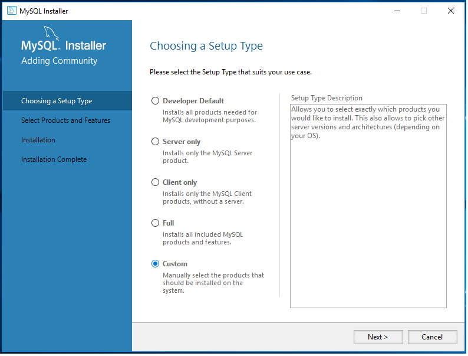
4. From MySQL Server select, 
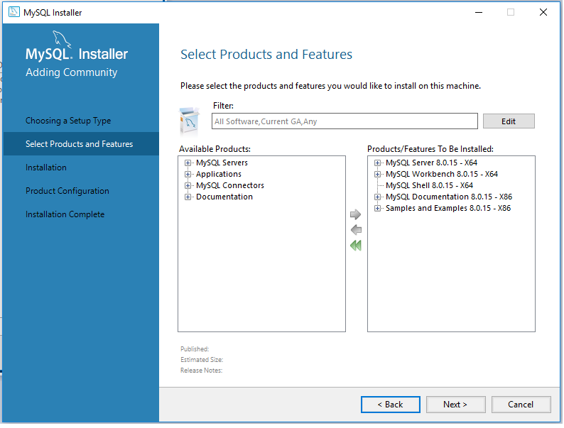
5.  
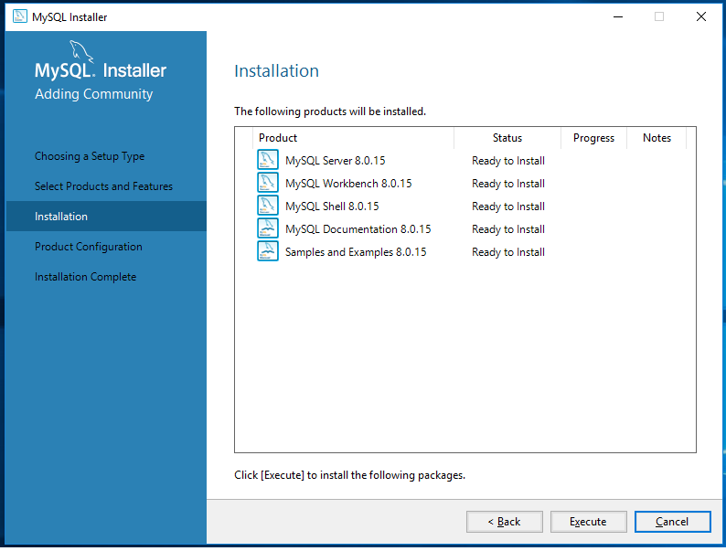
6.   
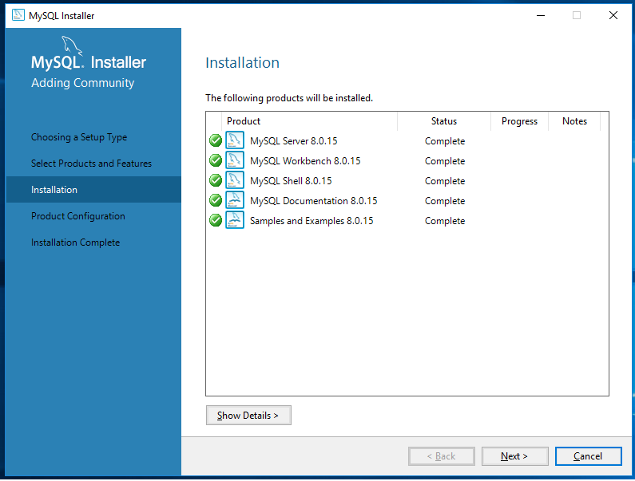
7.   
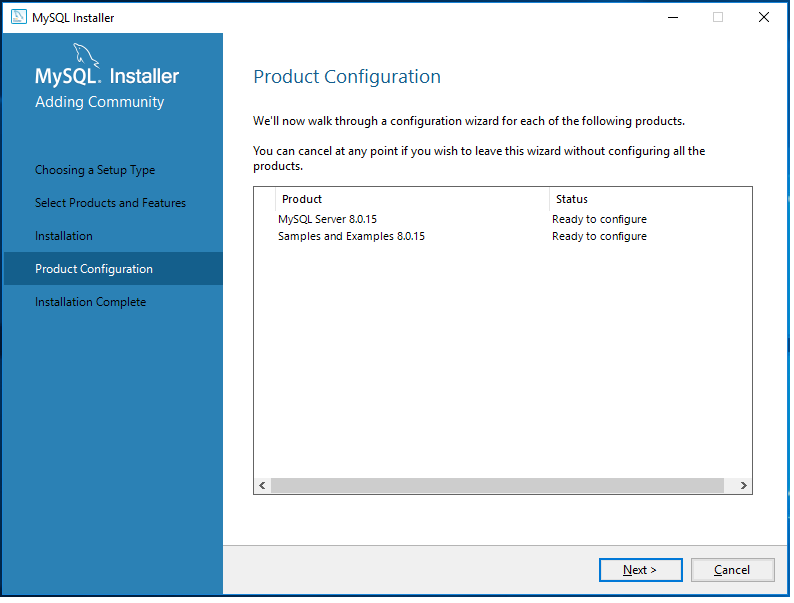
8.  
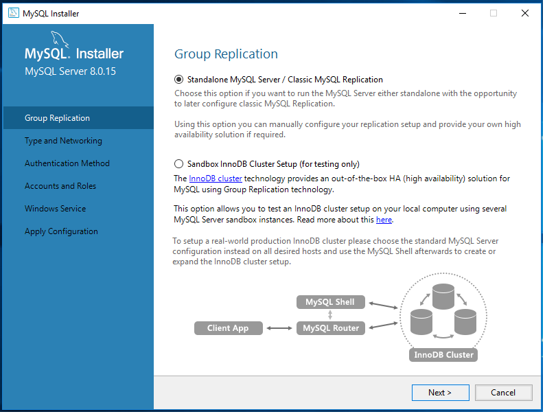
9.  
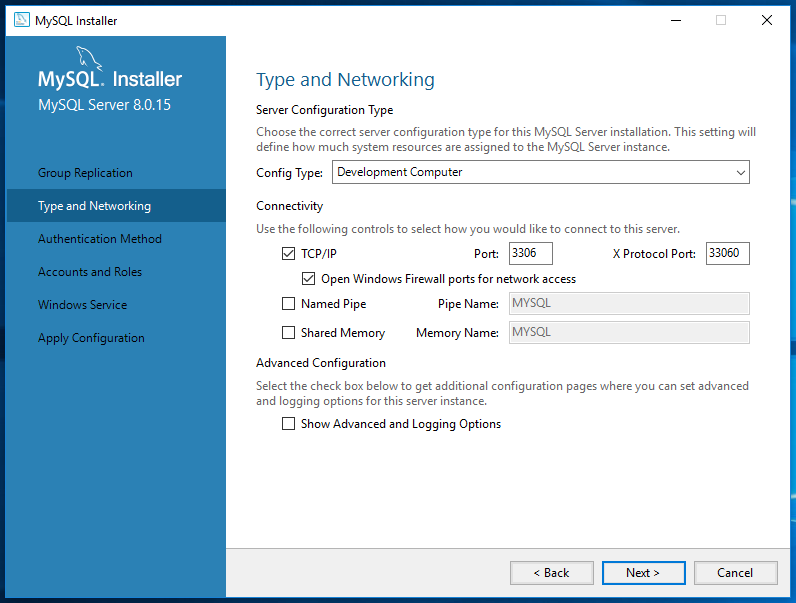
10. 
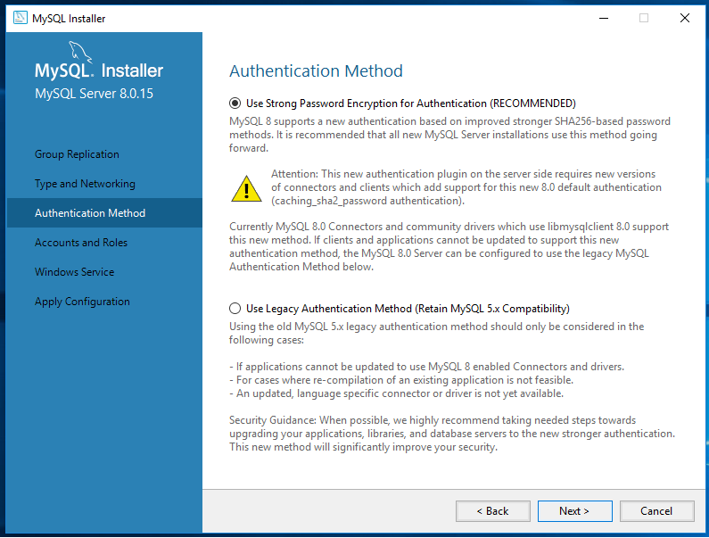
11.   
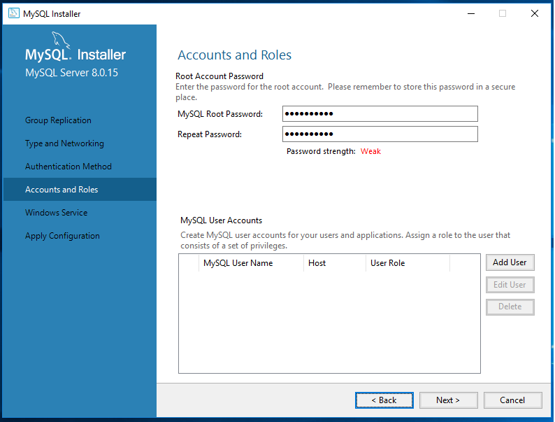
12.   
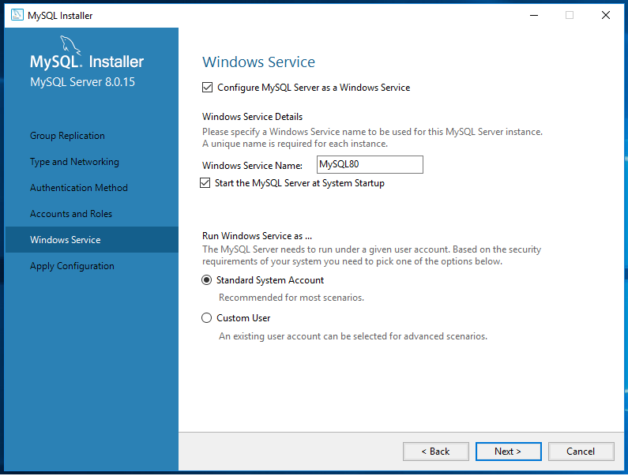
13.   
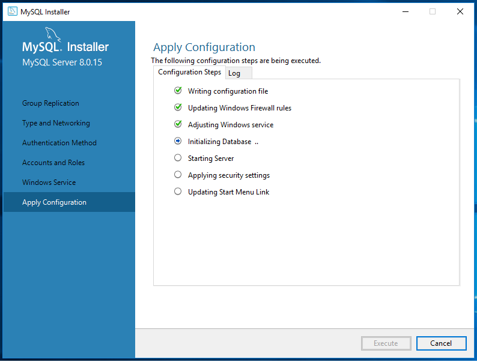
14.  
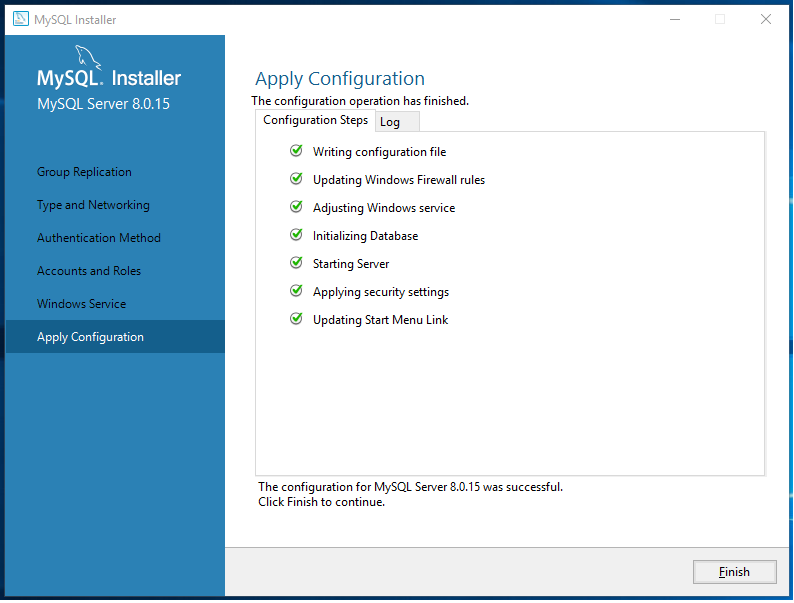
15.     
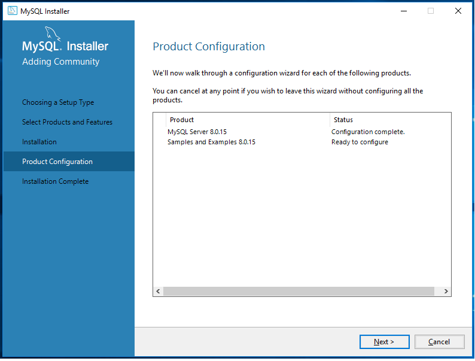
16.   
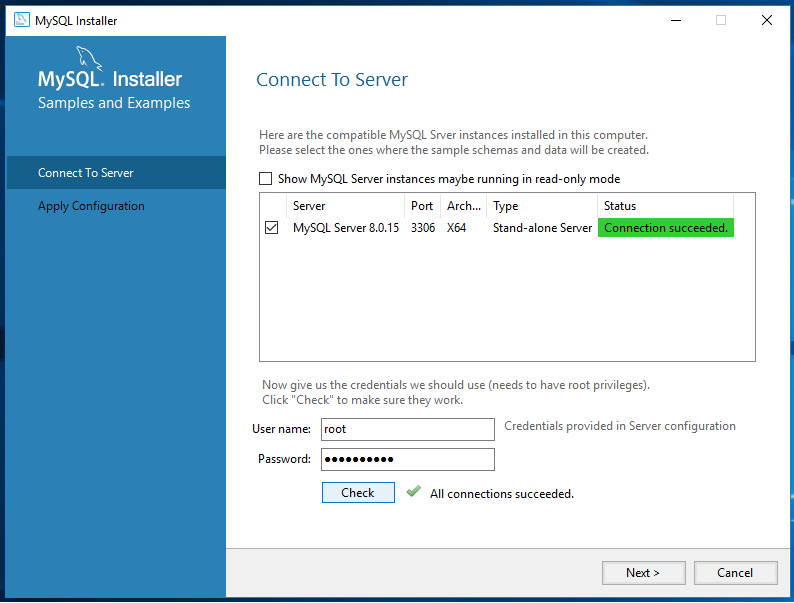
17.   
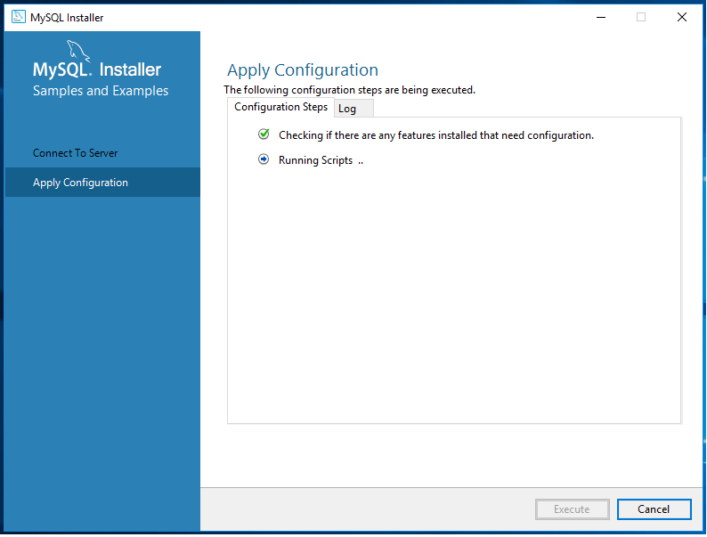
18.   
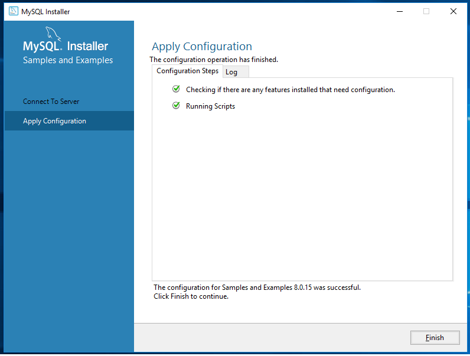
19.   
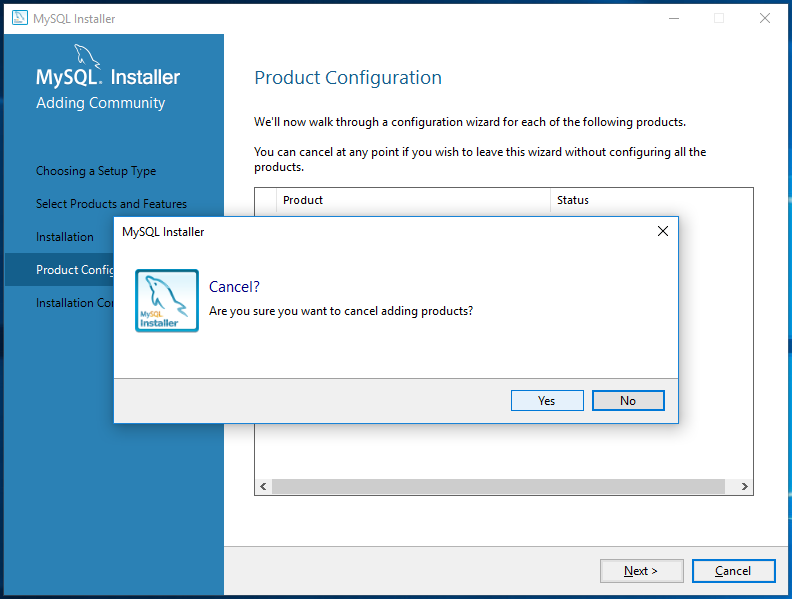
