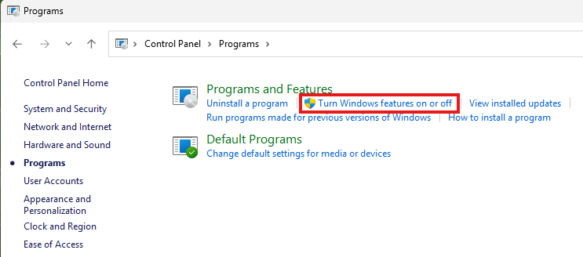
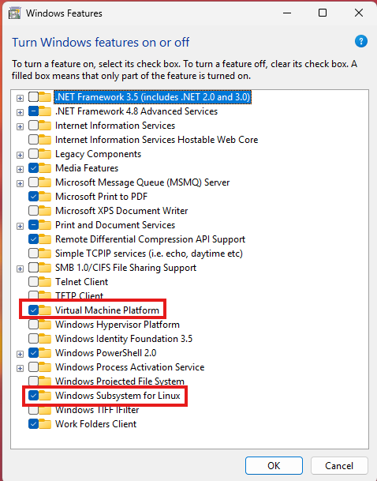
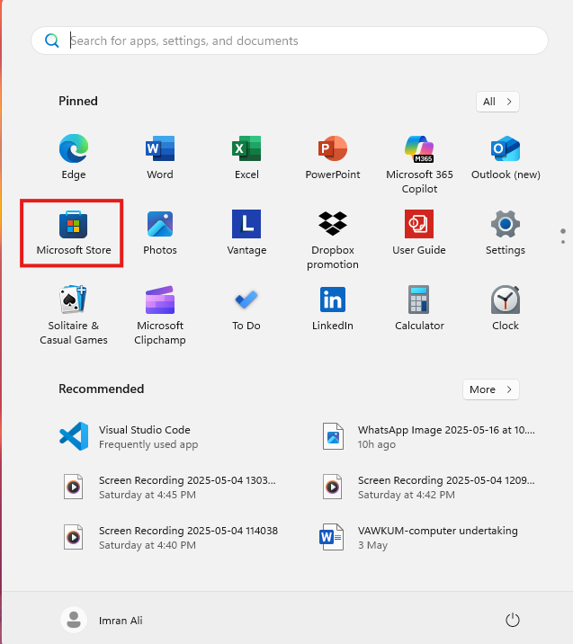
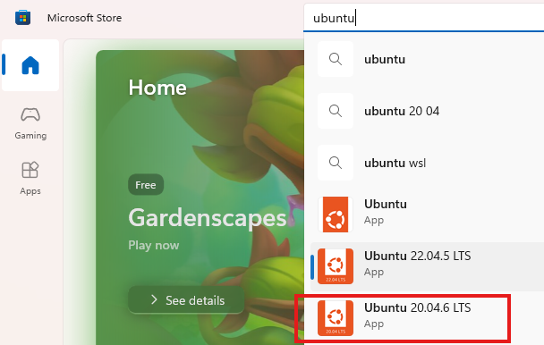

# Setup Windows Sub System for Linux MySQL and Postgres

## Prerequisites

- In this course, students are required to work in a Linux environment using WSL2 (Windows Subsystem for Linux 2).
- This approach allows Windows users to run a real Linux distribution directly from within Windows, avoiding the complexity of dual-booting or full virtual machines.
- The decision to use Linux is intentional and aligned with industry standards. 
- In most professional environments, database servers such as MySQL, PostgreSQL, Oracle, and MongoDB are deployed on Linux systems due to their performance, security, and scalability.
- Therefore, familiarity with the Linux command line is a critical skill for anyone pursuing a role in database administration (DBA).
- By setting up WSL2 and installing MySQL and PostgreSQL within this environment, students gain hands-on experience with:

   + Navigating and operating within a Linux shell
   + Installing and configuring database software via command-line tools
   + Managing services (e.g., starting/stopping database servers)
   + Accessing logs, editing configuration files, and understanding file system structure
   + Running SQL commands using command-line clients

- This foundational exposure to the Linux environment will not only strengthen your technical competence but also prepare you for real-world database administration tasks that extend beyond GUI-based tools.
- A working installation of MySQL.
- A working installation of PostgreSQL.
- Command-line access to both MySQL and PostgreSQL

1. In Windows **Control Panel**, Select **Programs** and Under **Program and Features** Click **Turn Windows features on or off**

2. From the listed options select **Virtual Machine Platform** and **Windows Subsystem for Linux**, and click **OK**. This will take sometime and may require a Windows restart.

3. Now launch **Microsoft Store** from Windows start menu

4. Search for Ubuntu and select the latest stable release. "Ubuntu 24.04.6" (at the time of writing this manual)

5. Now Click the **Get** button. It will download and install WSL.

