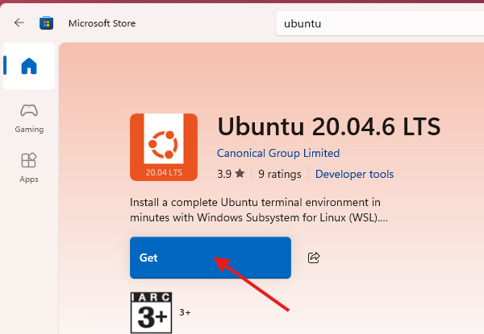

# Setup Windows Subsystem for Linux MySQL and Postgres

## Prerequisites

- In this course, students are required to work in a Linux environment using WSL2 (Windows Subsystem for Linux 2).
- This approach allows Windows users to run a real Linux distribution directly from within Windows, avoiding the complexity of dual-booting or full virtual machines.
- The decision to use Linux is intentional and aligned with industry standards. 
- In most professional environments, database servers such as MySQL, PostgreSQL, Oracle, and MongoDB are deployed on Linux systems due to their performance, security, and scalability.
- Therefore, familiarity with the Linux command line is a critical skill for anyone pursuing a role in database administration (DBA).
- By setting up WSL2 and installing MySQL and PostgreSQL within this environment, students gain hands-on experience with:

   + Navigating and operating within a Linux shell
   + Installing and configuring database software via command-line tools
   + Managing services (e.g., starting/stopping database servers)
   + Accessing logs, editing configuration files, and understanding file system structure
   + Running SQL commands using command-line clients

- This foundational exposure to the Linux environment will not only strengthen your technical competence but also prepare you for real-world database administration tasks that extend beyond GUI-based tools.
- A working installation of MySQL.
- A working installation of PostgreSQL.
- Command-line access to both MySQL and PostgreSQL

1. In Windows **Control Panel**, Select **Programs** and Under **Program and Features** Click **Turn Windows features on or off**

2. From the listed options select **Virtual Machine Platform** and **Windows Subsystem for Linux**, and click **OK**. This will take sometime and may require a Windows restart.

3. Now launch **Microsoft Store** from Windows start menu

4. Search for Ubuntu and select the latest stable release. "Ubuntu 24.04.6" (at the time of writing this manual)

5. Now Click the **Get** button. It will download and install WSL.

6. After installation completes Ubuntu will be available in start menu. When run for the first time it will ask for root user name and password. Type a user name and password and remember them.

7. It is better to run `sudo apt update` and `sudo apt upgrade -y` after the installation. In these commands **apt** (Advanced Package Tool) is the ubuntu package manager. We use it to install or uninstall programs. sudo (super user do) is written before commands which require administrative (root) privileges.

8. To install mysql in ubuntu `sudo apt install mysql-server`.

9. To start mysql service `sudo systemctl start mysql.service`

10. Secure mysql installation `sudo mysql_secure_installation`

11. To login mysql `sudo mysql -u root -p`, type mysql password when prompted for fresh installation there is no password, just hitting enter will work.

12. to quit mysql `exit`.

13. To install PostgreSQL `sudo apt install postgresql postgresql-contrib`

14. start postgresql service `sudo service postgresql start`

15. switch to the postgres user `sudo -i -u postgres`

16. type `psql` at prompt and hit enter.

17. to quit postgres type `\q`

