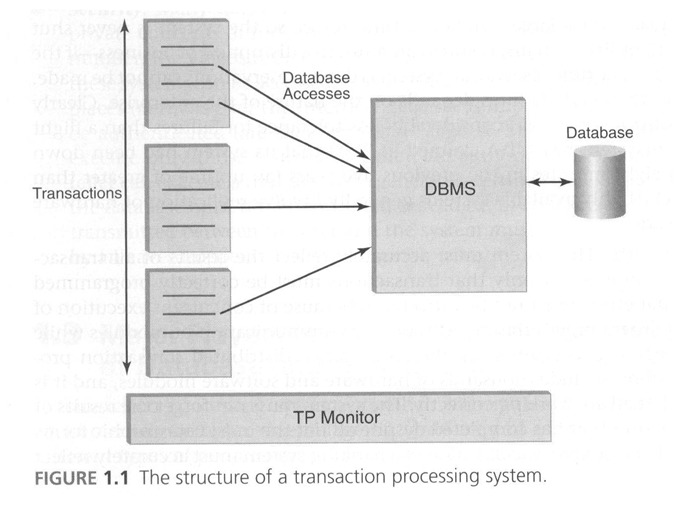
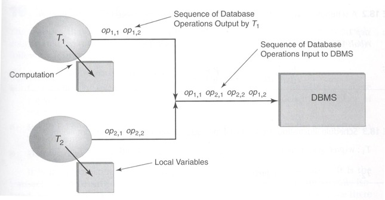

**Credits: contents presented here are taken from the book Database Systems An application oriented approach 2nd Edition by Michael Kifer, Arthur Bernstein, Philip M. Lewis**

# What is a transaction?
Databases frequently store information that describes the current state of an enterprise. For example, a bank's database stores the current balance in each depositor's account. When an event happens in the real world that changes the state of the enterprise, a corresponding change must be made to the information stored in the database. With online DBMSs, these changes are made in real time by programs called transactions, which execute when the real-world event occurs. 

For example, when a customer deposits money in a bank (an event in the real world), a deposit transaction is executed. Each transaction must be designed so that it maintains the correctness of the relationship between the database state and the real-world enterprise it is modeling. In addition to changing the state of the database, the transaction itself might initiate some events in the real world. For example, a withdraw transaction at an automated teller machine (ATM) initiates the event of dispensing cash.

Credit card approval is only one example of a transaction that you executed on your vacation in Tokyo. Your flight arrangements involved a transaction with the airline's reservation database, your passage through passport control at the airport involved a transaction with the immigration services database, and your check-in at the hotel involved a transaction with the hotel reservation database. Even the phone call you made from your hotel room to tell your family you had arrived safely involved transactions with the hotel billing database and with a long-distance carrier to arrange billing and to establish the call. 

Other examples of transactions you probably execute regularly involve ATM systems, supermarket scanning systems, and university registration and billing systems. Increasingly, these transactions entail access to distributed databases: multiple databases managed by different DBMSs stored at different geographical locations.

# What is a transaction processing system? 
A transaction processing system (TPS) includes one or more databases that store the state of an enterprise, the software for managing the transactions that manipulate that state, and the transactions themselves that constitute the application code. In its simplest form the TPS involves a single DBMS that contains the software for managing transactions. More complex systems involve several DBMSs. In this case, transaction management is handled both within the DBMSs and without, by additional code called a TP monitor that coordinates transactions across multiple sites (see Figure 1.1). 

Because of the requirement that a transaction processing application must maintain an accurate model of the state of the enterprise, the execution of transactions is constrained by certain properties that do not apply to ordinary programs.
These special properties are frequently referred to using the acronym ACID: Atomic, Consistent, Isolated, Durable.

## Consistency
Think of a database as playing both an active and a passive role in relation to the real world enterprise that it models.

In its passive role, it maintains the correspondence between the database state and the enterprise data. For example, the Student Registration System must accurately maintain the identity and number of students who have registered for each course.
In its active role, it enforces certain rules of the enterprise. For example the number of students registered for a course must not exceed the maximum enrollment for that course.
A transaction that attempts to register a student for a course that is already full must not complete successfully. Consistency is the term that is used to describe these issues and it has two aspects.
**Internal consistency:** It is often convenient to store the same information in different forms. For example, we might store the number of students registered for a course as well as a list whose entries name each student registered for the course. A database state in which the length of the list is not equal to the number of registrants is not allowed.
**Enterprise rules:** Enterprise rules restrict the possible state of the enterprise. When such a rule exists, the possible state of the database are similarly restricted. The rule relating the number of registrants and the maximum enrollment in a course is one example.
The restrictions are referred to as integrity constraints or consistency constraints.

## Atomicity
The system must ensure that either the transaction runs to completion or if it does not complete, it has no effect at all (as if it had never been started).

If a transaction successfully completes and the system agrees to preserve its effects, we say that it has committed. If the transaction does not successfully complete we say that it has aborted, and the system must ensure that whatever changes the transaction made to the database are undone or rolled back.
**Why transactions abort?**
A transaction might be aborted for several reasons.

One possibility is that the system crashes during its execution(before it commits). Other possibilities include the following:
Allowing the transaction to complete would cause a violation of an integrity constraint.
Allowing the transaction to complete would violate the isolation requirement, meaning that there is a possibility of a "bad interaction" with another executing transaction.
The transaction is involved in a deadlock, meaning two or more transactions are each waiting for the others to complete, and hence none would complete if the system did not abort one of them.

## Durability
The system must ensure that once the transaction commits, its effects remain in the database even if the computer or medium on which the database is stored subsequently fails.

Durability can be achieved by storing data redundantly on different backup devices. In real world we want the committed data in our system to survive the following events:

- CPU crash
- Disk failure
- Multiple disk failures
- Fire
- Malicious attacks

## Isolation
In discussing atomicity, consistency, and durability, we concentrated on the effect of a single transaction. We next examine the effect of executing a set of transactions. We say that a set of transactions is executed sequentially or serially, if one transaction in it is executed to completion before another is started. Hence, at any given time only one transaction is being processed. 

When the first transaction in the set starts, the database is in a consistent state and, since the transaction is consistent, the database will be consistent when the transaction completes. Since the database is consistent when the second transaction starts, it too will perform correctly, and the argument repeats.

Modern computing systems are capable of servicing more than one transaction simultaneously, we refer to this mode of execution as concurrent execution. Concurrent execution is appropriate in a TPS serving many users. In this case, there are many active, partially completed transactions at any given time.

In concurrent execution, the database operations of different transactions are effectively interleaved in time, as shown in figure below:

[Link to video lecture](https://www.youtube.com/watch?v=LLDNsfQ0J0Y&amp)

